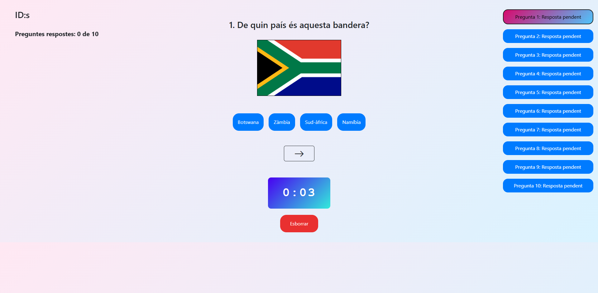

<h1> Projecte sobre el quiz </h1>

Per veure el projecte en producció fes click a l'enllaç o l'imatge

<a href="http://a24alvsalalvpr0.daw.inspedralbes.cat/src/" target="_blank">Projecte Banderes</a>

<h2>Objectiu</h2>

<h3> Frontend</h3>

En aquest part del projecte ens han plantejat fer una pàgina web sobre un quiz que sigui (responsiu),adaptat també per a dispositius mòbils apart de l'implementació del SPA es a dir que la pàgina es recarrega només una vegada que es quan accedim a la pàgina ,
 

<h3> Backend</h3>

Aquí hem aplicat el concepte del CRUD es a dir un panell d'aministració en el que gestionem les dades i afegim les diferents operacions com crear , editar , veure i borrar les preguntes , respostes i imatges del quiz 
 

<h3> Vercel </h3>

Com eina de desplegament hem utilitzat Vercel per veure la nostra página en un entorn de producció apart de penjarla al domini de l'institut 

<a href="https://pr0-eight.vercel.app">Aplicació desplegada aquí</a>

